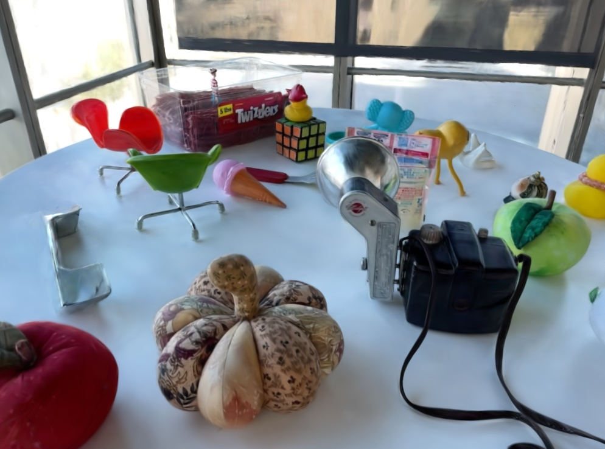
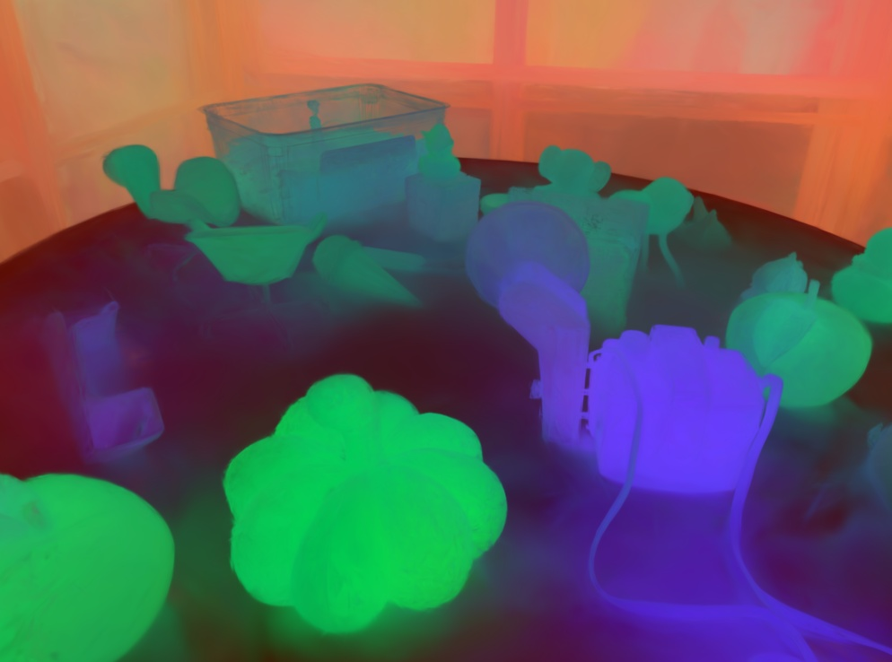

## Quick Pipeline to Run and Test Feature Lifting

## Installation 
We provide the following three submodules
- gsplat_ext
- gs_loader
- feature_viewer

first, one needs to install [nerfstudio](https://docs.nerf.studio/), and then install the above three package.


- Install NeRF Studio
```
conda create --name feature_lifting -y python=3.8
conda activate feature_lifting
python -m pip install --upgrade pip

pip install torch==2.1.2+cu118 torchvision==0.16.2+cu118 --extra-index-url https://download.pytorch.org/whl/cu118

conda install -c "nvidia/label/cuda-11.8.0" cuda-toolkit 
## remember to switch mirror if u r in main-land China, use sustech mirror

pip install ninja git+https://github.com/NVlabs/tiny-cuda-nn/#subdirectory=bindings/torch
## If it does not work, clone the repo to local, and cd to bindings/torch, and pip install .

pip install nerfstudio
```

- We use [FeatUp](https://github.com/mhamilton723/FeatUp) for experiment. If someone wants to try light weight detector version, one needs to install [openCLIP](https://github.com/mlfoundations/open_clip) and [YOLO](https://github.com/ultralytics/ultralytics) light weight detector
```
# some time after installation, the module is not updated correctly in site-package
# one can always manually clone to local, and install manually
pip install git+https://github.com/mhamilton723/FeatUp
pip install open_clip_torch
pip install ultralytics
```

- Install Submodules
```
git submodule update --init --recursive
cd submodules
pip install gs_loader/ # This mode is the loader helper function
pip install gsplat_ext/ # This module is the backend for feature lifting
pip install feature_viewer/ # This module is for online rendering and online segmentation
```

## Test Dataset
- We give an example [run shell](./run_lerf.sh) for LeRF_ovs DATASET
- We use original dataset format (nerfstudio data format), [LERF](https://www.lerf.io/)
- For IoU rating, we use [LangSplat](https://github.com/minghanqin/LangSplat) Segmented Results 
- If one's connection is unstable, one can download it manually
```
pip install gdown
mkdir datasets
cd dataset
# LangSplat data download
gdown https://drive.google.com/uc?id=1QF1Po5p5DwTjFHu6tnTeYs_G0egMVmHt 
unzip lerf_ovs.zip
cd lerf_ovs
rm -r figurines/ ramen/ teatime/ waldo_kitchen/

# LeRF Original Dataset
mkdir dataset && cd dataset
gdown https://drive.google.com/uc?id=1cwjLOpUKc--1YMpdUYuv4ZnZiUkvaubL
gdown https://drive.google.com/uc?id=1t08_1xV1h5pCdU6-oKRP49veUjxUSM_8
gdown https://drive.google.com/uc?id=1F5XSOIcJJyE9JYAm_w0_Trcw_KZyjjmB
gdown https://drive.google.com/uc?id=1LqmUsixkDkw7GIWQX0ZmJxXjFdMMlPjc

unzip ramen.zip
unzip figurines.zip
unzip teatime.zip
unzip waldo_kitchen.zip

rm ramen.zip figurines.zip teatime.zip waldo_kitchen.zip 
rm -r __MACOSX # remove the MACOSX folder if one is not macos user
```


## RUN
- We provide a example [scripts](./run_lerf.sh), one can use it as a begining
- If one follow the above instruction, when running the example scripts, there should be no need to input anything, just press enter
```
Enter dataset path [default: ./datasets/lerf_ovs/dataset]: # Input is the dataset
Enter eval path [default: ./datasets/lerf_ovs/label]: # Input is the labels result
Enter output path [default: ./evaluation/rendered_result]: # Input is the evaluated image location
```


## Evaluation Example
For 2D Downstream task, we have to project feature to 2D, if one wants to see 3D segment result, please check the next section
- After finising above procedure, we will find the result in the designated eval path 
- We will have three folder for each scene, one for rendered rgb, one for 2D feature map, and one for feature_pca
- Notice that feature is high dimensional file, feature PCA is just for visualization

|  |  |
|-----------------|-----------------|


## 3D segmentation and Visualization
- If one want to do online 3D segmentation and attention visualization, one can run the following code
- One can check the following youtube video for what the visualization result should look likes
```
    # python visualizer.py --gs_ckpt $(the file we trained using splatfacto, should be some_folder/step-00029999.ckpt in your nerfstudio output folder) \
    # --feat_pt feat.pt $(when we lift feature, there should be a feat.pt somewhere in your dataset, called feat.pt)
    python visualizer.py --gs_ckpt datasets/lerf_ovs/dataset/ramen/outputs/$(find "datasets/lerf_ovs/dataset/ramen/outputs" -type f -name "step-000029999.ckpt") \
    --feat_pt datasets/lerf_ovs/dataset/ramen/gs_feature.pt
```
[](https://youtu.be/x_Fx-sHaOCA) 


## Metrics